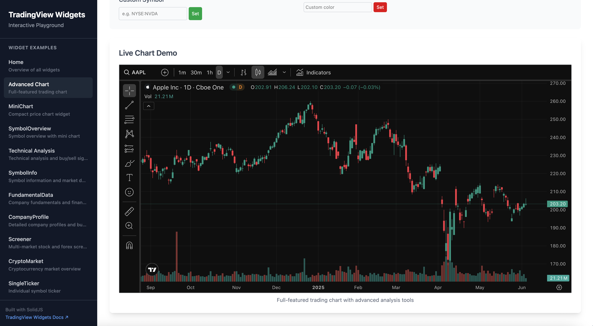

<p>
  
</p>

# @dschz/solid-tradingview-widgets

[](LICENSE)
[](https://www.npmjs.com/package/@dschz/solid-tradingview-widgets)
[](https://bundlephobia.com/package/@dschz/solid-tradingview-widgets)
[](https://github.com/dsnchz/solid-tradingview-widgets/actions/workflows/ci.yaml)

A comprehensive collection of **embeddable TradingView iframe widgets** for [SolidJS](https://www.solidjs.com/) applications. This library provides type-safe, reactive components that embed TradingView's powerful financial widgets directly into your SolidJS applications.

## 🌟 Features

- **🎯 Type-Safe**: Full TypeScript support with comprehensive prop validation
- **⚡ Reactive**: Built for SolidJS with reactive prop updates
- **🎨 Customizable**: Extensive theming and styling options
- **📱 Responsive**: Mobile-friendly widgets that adapt to container sizes
- **🌍 Multi-Language**: Support for 30+ locales
- **🔧 iframe-Based**: Secure, sandboxed TradingView widgets
- **📦 Tree-Shakable**: Import only the widgets you need
- **🚀 Performance**: Optimized loading and error handling

## 🎮 Interactive Playground



Explore all 12 widgets with real-time configuration controls, theme switching, and live examples.

The playground features:

- **📊 12 Widgets**: Complete collection with interactive demos (more to come in the future)
- **⚙️ Live Configuration**: Adjust props and see changes instantly
- **🎨 Theme Testing**: Switch between light/dark modes
- **📱 Responsive Preview**: Test different sizes and layouts
- **🔍 Feature Comparison**: Side-by-side widget comparisons
- **📝 Code Examples**: Copy implementation examples

Perfect for testing widgets before integration, exploring customization options, and understanding each widget's capabilities.

### Run Playground Locally

To explore the playground locally or contribute to its development:

```bash
# Clone the repository
git clone https://github.com/dsnchz/solid-tradingview-widgets.git
cd solid-tradingview-widgets

# Install dependencies
bun install
# or yarn install
# or pnpm install

# Start the development server
bun start

# Open http://localhost:3000 in your browser
```

The local playground includes hot-reload for instant feedback when exploring widget configurations or contributing improvements.

## 📊 Available Widgets

> Note: Not all widget components have been implemented. The rest will be planned in a future release.

### 📈 Charts

| Widget             | Description                 | Key Features                                     |
| ------------------ | --------------------------- | ------------------------------------------------ |
| **AdvancedChart**  | Full-featured trading chart | 100+ indicators, drawing tools, multi-timeframes |
| **MiniChart**      | Compact price chart         | Lightweight, customizable colors, date ranges    |
| **SymbolOverview** | Symbol with mini chart      | Price + chart combination                        |

### 🏷️ Symbol Details

| Widget                | Description                | Key Features                             |
| --------------------- | -------------------------- | ---------------------------------------- |
| **SymbolInfo**        | Real-time symbol data      | Price, change, volume, market cap        |
| **TechnicalAnalysis** | Technical indicator gauges | RSI, MACD, moving averages analysis      |
| **FundamentalData**   | Financial metrics          | P/E ratios, revenue, margins, growth     |
| **CompanyProfile**    | Company information        | Business description, sector, statistics |

### 🎯 Tickers

| Widget           | Description              | Key Features          |
| ---------------- | ------------------------ | --------------------- |
| **SingleTicker** | Individual symbol ticker | Compact price display |

### 🔍 Screeners

| Widget           | Description                    | Key Features                        |
| ---------------- | ------------------------------ | ----------------------------------- |
| **Screener**     | Multi-market stock screener    | Filter by fundamentals & technicals |
| **CryptoMarket** | Cryptocurrency market overview | USD/BTC pricing, market cap ranking |

### 📰 News & Events

| Widget               | Description              | Key Features                         |
| -------------------- | ------------------------ | ------------------------------------ |
| **TopStories**       | Financial news feed      | Market news, symbol-specific stories |
| **EconomicCalendar** | Economic events calendar | GDP, inflation, central bank events  |

## 🚀 Quick Start

### Installation

```bash
npm install @dschz/solid-tradingview-widgets
# or
yarn add @dschz/solid-tradingview-widgets
# or
pnpm add @dschz/solid-tradingview-widgets
# or
bun add @dschz/solid-tradingview-widgets
```

### Basic Usage

```tsx
import { AdvancedChart, SingleTicker, TopStories } from "@dschz/solid-tradingview-widgets";

function App() {
  return (
    <div>
      {/* Apple stock chart */}
      <AdvancedChart symbol="NASDAQ:AAPL" colorTheme="dark" width={800} height={400} />

      {/* Bitcoin price ticker */}
      <SingleTicker symbol="BINANCE:BTCUSDT" colorTheme="light" />

      {/* Financial news */}
      <TopStories feedMode="all_symbols" colorTheme="light" />
    </div>
  );
}
```

## 🎨 Theming & Customization

All widgets support extensive customization options:

```tsx
<AdvancedChart
  symbol="NASDAQ:AAPL"
  colorTheme="dark"
  backgroundColor="rgba(13, 13, 13, 1)"
  gridColor="rgba(255, 255, 255, 0.1)"
  locale="es"
  timezone="America/New_York"
  showVolume={true}
  showDrawingToolsBar={true}
  indicators={["relativeStrengthIndex", "bollingerBands"]}
/>
```

### Color Format Support

Widgets support all CSS color formats:

- **Hex**: `#1a1a1a`, `#ff6b3580`
- **RGB/RGBA**: `rgb(255, 107, 53)`, `rgba(41, 98, 255, 0.3)`
- **HSL**: `hsl(210, 100%, 50%)`
- **OKLCH**: `oklch(0.7 0.15 180)`

## 🌍 Multi-Language Support

The library supports 30+ languages:

```tsx
<Screener
  exchange="germany"
  locale="de"  // German
  colorTheme="light"
/>

<EconomicCalendar
  locale="ja"  // Japanese
  colorTheme="dark"
/>
```

## 📱 Responsive Design

Widgets automatically adapt to their containers:

```tsx
{
  /* Full-width responsive chart */
}
<AdvancedChart
  symbol="FOREX:EURUSD"
  autosize={true} // Takes full container size
/>;

{
  /* Fixed-size chart */
}
<AdvancedChart symbol="FOREX:EURUSD" width={600} height={400} autosize={false} />;
```

## 🔧 iframe Architecture

These widgets are **embedded TradingView iframes**, which means:

- ✅ **Secure**: Sandboxed execution environment
- ✅ **Reliable**: Direct data from TradingView servers
- ✅ **Up-to-date**: Always latest TradingView features
- ✅ **Performance**: Optimized by TradingView team
- ⚠️ **Network Required**: Widgets need internet connectivity
- ⚠️ **External Dependency**: Relies on TradingView's CDN

## 🔮 Upcoming Widgets

The following widget categories are planned for future releases:

### 📋 Watchlist/Ticker Widgets

- **Ticker**: Horizontal glance of instrument stats
- **TickerTape**: Wall Street style scrolling ticker tape
- **MarketOverview**: Market sector performance overview
- **StockMarket**: Customizable stock market watchlists
- **MarketData**: Real-time market data tables

### 🗺️ Heatmap Widgets

- **StockHeatmap**: Stock performance heatmaps
- **CryptoCoinsHeatmap**: Cryptocurrency market heatmaps
- **ForexCrossRates**: Currency cross-rates visualization
- **ETFHeatmap**: ETF performance heatmaps
- **ForexHeatmap**: Forex market strength visualization

_Stay tuned for these exciting additions in upcoming releases!_

## 📚 Documentation

### Widget Categories

- **[Charts](https://www.tradingview.com/widget-docs/widgets/charts/)**: Advanced charting capabilities
- **[Symbol Details](https://www.tradingview.com/widget-docs/widgets/symbol-details/)**: Company and instrument data
- **[Tickers](https://www.tradingview.com/widget-docs/widgets/tickers/)**: Price tickers and feeds
- **[Screeners](https://www.tradingview.com/widget-docs/widgets/screeners/)**: Market screening tools
- **[News](https://www.tradingview.com/widget-docs/widgets/news/)**: Market news tools
- **[Calendars](https://www.tradingview.com/widget-docs/widgets/calendars/)**: Market economic calendars

### API Reference

Each widget comes with comprehensive TypeScript definitions and JSDoc documentation. Check your IDE's IntelliSense for detailed prop descriptions and examples.

## 🤝 Contributing

We welcome contributions! Please follow these guidelines:

- **Clean Git History**: Rebase instead of merge commits
- **Conventional Commits**: Follow [conventional commit format](https://www.conventionalcommits.org/en/v1.0.0/)
- **CI Checks**: Ensure all tests and linting pass
- **TypeScript**: Maintain type safety
- **Documentation**: Update JSDoc and README as needed

## 📄 License

MIT License - see [LICENSE](./LICENSE) file for details.
